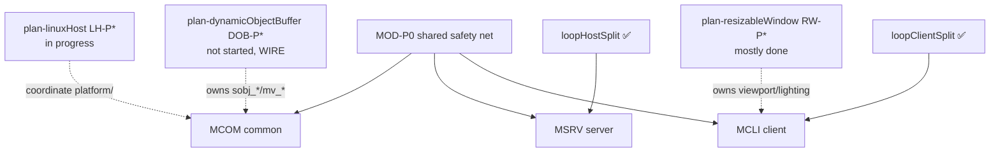

# Ultima VI Online — Modernization Program (master index)

Status legend: ⬜ todo · 🟡 in-progress · ✅ done · ⏭ deferred · ❌ blocked
Update the checkbox + add a short note (date, commit, author) when status changes.

> Source of truth for the *whole-project* modernization effort.
> These plans are written to be executed by the **`cpp-modernizer` agent**
> (`.github/agents/cpp-modernizer.agent.md`) under the rules in
> `.github/copilot-instructions.md` (§Project direction).
> Each plan is independently trackable; this file sequences them and defines the
> shared safety net, risk tiers, verification matrix, and metrics.

---

## 0. Why this program exists

The codebase is being deliberately migrated from its 1990s C-with-extensions
origins toward clean, documented, modern C++17/20.
This program turns that direction into concrete, checkbox-tracked work the
`cpp-modernizer` agent can pick up one verifiable increment at a time.

The work is split by source tree so increments stay small and reviewable:

| Plan | Phase prefix | Tree | Scope headline |
|---|---|---|---|
| [`plan-modernize-common.md`](plan-modernize-common.md) | `MCOM-P*` | `src/common/` | shared constants, structs, `txt`/`file`, wire bit-packers, globals, `WinMain`/main loop, `house.cpp`, RNG, platform seam |
| [`plan-modernize-client.md`](plan-modernize-client.md) | `MCLI-P*` | `src/client/` | `function_client.cpp`, `myddraw.cpp` + inline asm, the `loop_client` parts, UI panels, viewport, audio |
| [`plan-modernize-server.md`](plan-modernize-server.md) | `MSRV-P*` | `src/server/` | `function_host.cpp` god-functions, `.inc` elimination, the `loop_host` parts, global-state encapsulation, AI hot paths |

The pre-existing [`docs/plans/plan-serverRefactor.md`](../../plan-serverRefactor.md)
is the ancestor of `plan-modernize-server.md`; it predates the loop split and is
now **superseded** (see the banner at its top). Its phase content is folded into
`MSRV-P*`.

---

## 1. The Prime Directive (never bends)

**Behavior preservation.**
Every change must be a *semantics-preserving transformation*.
The network wire format, `.sav` byte layout, rendered pixels, RNG draw
sequence, and observable timing must be **bit-for-bit identical** after each
change.
A modernization that shifts a single encoded bit, struct byte, or pixel is a
**regression**, not an improvement — prove equivalence (§4) or do not ship it.

Corollaries (these survive the whole program):

- Do **not** change the wire format, `struct player` byte layout, or `.sav`
  format as a side effect of a refactor.
- Do **not** bump `U6O_VERSION` (a real wire change is out of scope here — that
  is a behavior change, not modernization).
- Do **not** compute mover/sobj positions from the client's dynamic `tpx`/`tpy`
  when decoding host messages — use `tpx_legacy`/`tpy_legacy`.
- Do **not** reorder side effects, RNG draws, or I/O.
- Do **not** use `insert_edit_into_file` on the brace-seam loop fragments under
  `src/{client,server}/loop/`.

---

## 2. Risk tiers (decide before every edit)

These mirror the `cpp-modernizer` agent's tiers; classify every region first.
The tier sets the required verification rigor.

| Tier | What it is | Required evidence before shipping |
|---|---|---|
| **T0 — Free** | self-contained pure helpers, local-only logic, dead/commented code, local scratch renames, comment/Doxygen additions, magic-number→named-constant where the value is unchanged | tri-target build green; quick smoke |
| **T1 — Guarded** | non-hot functions touching shared state, file-I/O parsing, UI layout, map-patch loaders, de-`goto` of non-hot flow | characterization harness / golden capture diff; tri-target build |
| **T2 — Wire/Serialize** | network encode/decode, `.sav` read/write, `BITSadd`/bit-packing, `struct` byte-blits, the `.cpp`+`.inc` mirrors | exact byte-stream capture before==after across an input matrix; encoder+decoder+both mirrors+client+host together; `U6O_VERSION` unchanged |
| **T3 — Hot path / asm** | `loop_host` AI loops, `loop_client` world-render/lighting, `inline_asm/*.asm`, `_asm{}` blocks, per-frame/per-tile inner loops | pixel/byte-exact golden comparison **and** a before/after benchmark (no meaningful regression) |

When unsure, escalate the tier (treat as more dangerous), never down.

---

## 3. `MOD-P0` — Shared safety net (do ONCE, before any tree's P1)

This phase is shared by all three plans; complete it before starting
`MCOM-P1` / `MCLI-P1` / `MSRV-P1`.

- ⬜ `MOD-P0.1` Capture a **baseline tri-target build** (`client`, `host`,
  `both`) in Debug and Release; record exact warning counts (note the known
  pre-existing `C4731` inline-asm `ebp` warnings in
  `loop_client_part_world_render.cpp` so future deltas are visible).
- ⬜ `MOD-P0.2` Create `tools/modernize/` with a tiny harness scaffold and a
  `golden/` directory; document the capture idiom for each evidence type
  (return values + out-params, encoded byte buffers as hex, framebuffer/surface
  byte dumps, RNG call-count probes).
- ⬜ `MOD-P0.3` Add a `clang-format` config matching the current brace/indent
  style; apply it to **new** files only (never reformat a brace-seam loop
  fragment or a file mid-relocation).
- ⬜ `MOD-P0.4` Stand up the equivalence oracles the program will reuse:
  the preprocessor token-stream oracles already exist
  (`tools/loop_split_oracle*.ps1`) but only validate *pure relocation* — they
  do **not** validate token-changing modernization. Document this clearly and
  define the byte-stream / pixel / RNG capture procedures that **do** apply.
- ⬜ `MOD-P0.5` Decide the execution-record location: per-area records go under
  `docs/modernization/<area>-<phase>.md` (a sibling of `docs/plans/`, as the
  copilot-instructions and the agent expect). Each record states scope, risk
  tier, equivalence evidence, before/after, and remaining work.
- **Exit:** repeatable tri-target build + warning baseline recorded;
  `tools/modernize/` scaffold exists; capture procedures documented; record
  location agreed.

---

## 4. Verification matrix

| Touched code consumes / produces | Minimum evidence |
|---|---|
| pure value (return/out-param only) | characterization diff vs golden (T0/T1) |
| network bytes (`BITSadd`/decode, message build) | byte-stream capture before==after across input matrix (T2) |
| `.sav` bytes | save round-trip: write→read reproduces the struct bit-exactly (T2) |
| rendered pixels (blit/lighting/asm) | destination-surface byte dump equality + microbenchmark (T3) |
| RNG (`src/common/random/`) | RNG call count **and** order unchanged (T2/T3) |
| any shared-code change | `client` + `host` + `both` all build, zero new warnings |

If you cannot construct the matching equivalence check for a region, that region
is **not safe to modernize yet** — record it and stop.

---

## 5. Sequencing vs the in-flight plans

Several plans are already mid-flight and own specific files/constants.
Modernization must not collide with them.

Hard coordination rules:

- **`DOB-P*` owns the wire buffers.**
  Do not restructure `sobj_*[96][72]`, `sobj_tempfixed`, `mv_*`, `MV_TX_*`, or
  `SOBJ_TX_*` as part of modernization — those are mid-migration (T2/wire).
  Renaming-for-readability of these fields waits until DOB lands or is explicitly
  coordinated; a rename touches every byte-blit site at once.
- **`LH-P*` owns `src/common/platform/`.**
  Treat the platform shim as a portability seam, not a modernization target,
  until LH completes; coordinate any change to `plat_*.h` with that plan.
- **`RW-P*` owns viewport sizing & lighting buffers** (`backbufferW/H`,
  `lighting_*`, `kViewportTilesXMax`).
  Modernize *around* it; reuse the already-planned constant names from
  `docs/resizable-window-hotspots.md` for the `96/72/32/24` family.
- The loop splits (`LCS`/`LHS`) are **done** — the `loop_*` parts are the
  raw material for `MCLI`/`MSRV` hot-path modernization, edited only with
  `replace_string_in_file` (tight context) or the `tools/loop_split_*` tools.

---

## 6. Global progress dashboard

Update at the end of every phase across all three plans.

| Metric | Baseline (2026-06-16) | Current | Target |
|---|---|---|---|
| `#define` magic numbers (define_both/host/client) | very high | TBD | data tables / enums only |
| Include guards converted to `#pragma once` | 3 files | 3 | all `.h` |
| `extern` globals (data_both/host/client + globals.inc) | ~300+ | TBD | grouped state objects; 0 bare |
| Largest function (lines) | ~750 (`wpf_pathfind`) | ~750 | ≤150 |
| `goto` occurrences (non-loop `.cpp`) | ~35 + loop labels | TBD | 0 outside justified state machines |
| Inline `_asm`/`__asm` blocks | 16 | 16 | 0 (converted behind same signatures, T3) |
| `.inc` non-TU files (excluding loop fragments) | 6 | 6 | 0 |
| Raw `malloc`/`free` + `free()` overloads | many | TBD | RAII / named allocators |
| Doxygen-documented public functions | ~0 | TBD | all public API |

---

## 7. Standard increment workflow (per the agent)

1. Scope & classify (region + symbols + every caller/`goto`/constant use; assign tier).
2. Build the safety net (baseline tri-target build green; tier-appropriate capture).
3. Refactor in small semantics-preserving steps (`get_errors` after each).
4. Verify equivalence (diff vs golden / byte-stream / pixel / benchmark).
5. Document (Doxygen headers, constant comment blocks, `docs/modernization/` record).
6. Report (region, tier, equivalence evidence, tri-target build status, follow-ups).

---

## 8. Style appendix (target conventions)

- Types: `PascalCase` (`ObjectManager`, `HouseSystem`).
- Functions / methods: `camelCase` (`addItem`, `findLast`).
- Local variables: `camelCase` (`tileX`, `partyMemberIndex`).
- Constants / enumerators: `kCamelCase` (`kHouseMax`) or `enum class` members.
- New shared constants → `src/common/define_both.h`; client display constants →
  `src/client/viewport.h`; each with a math + wire/display/ABI-coupling comment.
- Namespaces: prefer `namespace u6o { … }` (and `u6o::client` / `u6o::server`),
  with unqualified `inline` shims for legacy `.inc`-concatenated call sites
  (mirror `viewport.h`).
- Prefer `#pragma once`, `enum class`, `constexpr`, `std::array`, `std::span`,
  `std::string_view`, `std::unique_ptr` — **except** in T3 inner loops, where any
  STL/RAII use must be benchmark-proven not to regress the frame/tick.
- Keep the historical author tags (`//metalhead*`, `//luteijn:`, `// RW-P*`,
  `// DOB-P*`, `// ROOMSYNC-P*`) — they are cross-referenced.

## Session handoff

- **2026-06-16 (program drafted).** Master index + the three per-tree plans
  committed. No code changes yet. Start at **`MOD-P0.1`** (shared safety net),
  then begin each tree at its `P1`. Honor the §5 coordination rules with the
  in-flight `DOB` / `LH` / `RW` plans.

