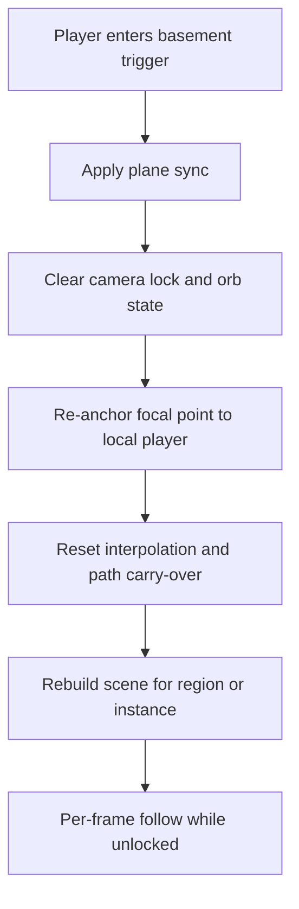

# Basement Transition Camera Desync: Root Cause and Fix

## Why this bug happened

The issue was not viewport centering math.
The issue was stale camera follow state after a basement transition.
When the player changed plane or region, the render camera stayed anchored to pre-transition state.
The local player and camera were no longer rebound to the same post-transition anchor.
That made the player appear in the new basement while the camera follow target remained out of sync.

## Root cause summary

Basement transitions are effectively a context switch.
They can change plane, chunk, region, and sometimes instance data in one step.
Our transition path did not force a camera follow rebind after that switch.
The transition also left interpolation or movement carry-over active in some cases.
That preserved ladder-entry render position artifacts into the next frame range.

## Reliable fix pattern

Apply a transition sync reset whenever entering a basement.

1. Set render plane to the player logical plane.
2. Clear camera lock or orb override state.
3. Re-anchor the camera focal point to the local player coordinates immediately.
4. Optionally hard-snap camera position to player coordinates if your client supports this.
5. Reset local player interpolation fields that can preserve pre-transition movement state.
6. Rebuild scene or instance tiles for the new basement context.
7. In the main tick, enforce focal-point follow every frame when camera is not locked.

## Transition flow

## Basements checklist for future content

Use this checklist for every new basement entrance or ladder transition.

- Add a basement-enter handler that performs the full camera plus actor sync reset.
- Verify render plane and logical plane match immediately after transition.
- Verify camera lock state is cleared unless a cutscene intentionally overrides it.
- Verify focal point updates to local player each frame when unlocked.
- Verify local interpolation is cleared so no ladder-top ghost position remains.
- Verify scene rebuild runs for the new region or instance before normal render loop continues.

## Fast regression test

1. Stand near a ladder and enter basement repeatedly.
2. Move immediately after loading into basement.
3. Confirm camera anchor is in basement and no old anchor is retained.
4. Confirm no temporary teleport, disappearance, or off-screen follow anchor.
5. Repeat in each new basement map before release.

## Notes for future maintainers

If a future basement shows similar symptoms, assume follow-anchor rebind failure first.
Check transition code before touching viewport centering code.
Treat any plane or instance transition as a required camera plus actor resynchronization point.

