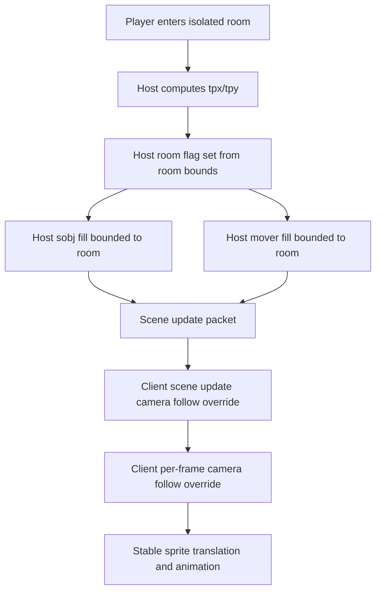

# Rendering Basement and Custom-Coordinate Guide

## Purpose

This guide documents how to keep rendering stable when a player enters a basement or any custom world coordinate room.
This includes camera follow behavior, mover and scene streaming boundaries, and walk animation continuity.
Use this as the first reference before touching viewport math, mover packet formats, or scene buffer logic.

## Current known isolated rooms

These rooms use the room-bound streaming + client follow-camera model below.
Both sit on the `x: 1280` sub-map boundary (the gargoyle-lands sub-map abuts
them to the west), so unbounded host streaming bleeds foreign movers/objects in
and desyncs the mover stream — the "player gets stuck on the ladder, then turns
invisible" bug.

| Room | World bounds | Host flag |
| --- | --- | --- |
| Guardian Guild basement | `x: 1280..1291`, `y: 319..333` | `gg_basement_room` |
| Brit 2nd-floor shop | `x: 1280..1340`, `y: 395..432` | `shop_2f_room` |

If you add another basement or isolated custom room, follow the same pattern
with that room's bounds: add a host room flag and bound the sobj + mover fill
loops to it in `src/server/loop_host.cpp`, and add the follow-camera override at
both client camera sites in `src/client/loop_client.cpp`.

## Global safety net: pin the local avatar to its logical position

The room-specific patches above all chase the same underlying fragility: the
local player's own avatar is rendered from the index-based mover delta list,
which can desync for many reasons (teleport, login / player-slot reuse,
redirector overflow, a single dropped/duplicated index). When it desyncs, the
avatar slot drifts away from the camera and you get "the camera moves logically
but the avatar sprite is stuck / invisible" -- anywhere, not just in a room.

There is a single global fix for the *avatar* (independent of all the room
work): the scene-update header `tplayer->x`/`tplayer->y` is the authoritative
avatar position the camera already follows, and the host stores the avatar's
own mover at that exact world tile (`mv_x[i] = mapx`). So at the end of the
client's type-31 handler (`src/client/loop_client.cpp`), pin our own mover
entry to `(tplayer->x, tplayer->y)` every update:

- Identify "self" via `clientplayerid`; bootstrap it from a player-mover sitting
  on the logical tile (true the frame the avatar is added, e.g. right after
  login/resync, before the slower name-match path resolves `clientplayerid`).
- Set that entry's `mv_x`/`mv_y` to the logical position. This is **self-healing**
  (it converges the client value toward the host's, since both equal the avatar's
  real position) and a **no-op when already in sync**, so it does not perturb the
  wire protocol.

This guarantees the avatar always renders at the camera centre everywhere. The
room patches remain worthwhile because they keep the *rest* of the scene correct
(no foreign-NPC bleed, correct mover encoding, clean index sync for animation),
but the avatar itself no longer depends on perfect mover-list sync.

## Core model to keep in mind

There are two coordinate frames active at once.

- The client render camera frame (`tpx` and `tpy`) should follow the local player in basement rooms.
- The host wire decode reference frame for scene object and mover decoding still relies on legacy-centered assumptions in client decode paths (`tpx_legacy` and `tpy_legacy`).

Most regressions came from mixing those frames.
Do not decode host-emitted object or mover offsets against the dynamic camera frame.

## Code areas of interest

### Client camera anchors

- `src/client/loop_client.cpp` scene update path (`type 31`) around `getscreenoffset_legacy(...)` and `getscreenoffset(...)`.
- `src/client/loop_client.cpp` per-frame render path around `getscreenoffset(tplayer->x, tplayer->y, &tpx, &tpy)`.

Both paths must agree on camera behavior for basement rooms.
If one follows and the other stays fixed, input/render desync appears immediately.

### Host scene and mover streaming

- `src/server/loop_host.cpp` scene update setup after `getscreenoffset(x, y, &tpx, &tpy)`.
- `src/server/loop_host.cpp` sobj fill window loop (`SOBJ_TX_W` and `SOBJ_TX_H`).
- `src/server/loop_host.cpp` mover fill window loop (`MV_TX_W` and `MV_TX_H`).

When in an isolated room, these loops must be constrained to room bounds.
Otherwise host streams foreign objects and movers from outside the room.

### Shared offset helpers

- `src/common/function_both.cpp`
- Functions: `getscreenoffset(...)` and `getscreenoffset_legacy(...)`.

Do not reintroduce fixed-basement map offsets here unless you also prove host fill and client draw stay coherent.
Room-specific camera behavior is safer in client camera paths and host room-bound filtering.

### Wire constants and decode geometry

- `src/common/define_both.h`

Relevant constants include `SOBJ_TX_*`, `SOBJ_S1_*`, and `MV_TX_*`.
These constants are wire coupled.
Change with care and keep host/client logic aligned.

## Root causes we observed

- Camera follow state applied in one client path but not the other.
- Fixed-room camera anchoring in shared offset helpers while client tried to follow dynamically.
- Host fill windows sampling outside isolated room bounds, producing non-room NPCs and stale mover collisions.
- Repeated buffer flush or resync behavior causing mover frame continuity loss.
- Type-416 view redirectors inside the room (e.g. the shop's "look down the
  hole" tiles) resolving a mover to a far-away tile (the floor below). The
  mover ADD encodes position window-relative (`mv_x - tpx + MV_TX_OFFX` in
  `MV_TX_BITS`); a far target overflows those bits, so the client stores a
  garbage in-window position while the host keeps the real far coords. The
  next offscreen prune then removes it on the host but not the client, the
  per-player mover arrays diverge, every mover index desyncs, and the
  avatar's slot gets reassigned -- the classic "walking just moves the
  camera, avatar frozen then invisible." Triggered only when a mover (often a
  wandering shopkeeper NPC) stands on a viewed tile, so it can appear minutes
  after entry and look intermittent.

## Fix strategy for any new basement or custom room

### 1) Keep camera locked to player movement

Implement room follow override in both client camera sites.

- Scene update camera assignment in `src/client/loop_client.cpp`.
- Per-frame render camera assignment in `src/client/loop_client.cpp`.

For a room bounds check, set:

- `tpx = playerX - (viewTilesX()/2 - 1)`
- `tpy = playerY - (viewTilesY()/2 - 1)`

Do this in both places.
Do not update only one.

### 2) Keep rendering constrained to the room

In host scene update, determine whether the selected player is inside the room.
Then constrain both streaming loops while in that room.

- sobj loop: reject `mapx` and `mapy` outside room bounds before object collection.
- mover loop: reject `mapx` and `mapy` outside room bounds before mover collection.

This prevents cross-room object and NPC bleed-through.

If the room contains type-416 view redirectors (they rewrite `mapx`/`mapy`
mid-loop to the tile being "viewed"), the mover loop needs the room-bounds
check **twice**: once before reading `od[mapy][mapx]` (the pre-redirect
position) and once again right before the mover is added to the list (the
post-redirect position). Otherwise a redirected mover pointing at a far tile
is collected, ADD-encoded with an overflowed window offset, and desyncs the
client mover array. See the `shop_2f_room` checks in
`src/server/loop_host.cpp` (`goto mover_add_complete`).

### 3) Force one clean resync when entering the room

A room can pull in a one-time global state change the first time anyone views
it after server start. The shop's type-416 view hole, for example, follows the
redirector during the object-activation scan and wakes the downstairs
shopkeeper (`info |= 32768`, done once per object). That cold dormant->active
transition happens *during* the very first entry and desyncs the incremental
mover stream, so the avatar sticks to the ladder while the camera follows.
Every entry afterwards finds the object already active, so only the first entry
after server start breaks -- the classic "works after the first time" tell.

Fix: detect room *entry* (rising edge) in the host scene update and set
`tplayer->resync = 1` once. Do **not** hook this to the ladder handler alone --
a player can arrive in the room without using a ladder (logging in already
inside, a teleport/spell, an admin move), and those paths would be missed.
Detect the edge with a per-player-slot latch (`player_in_isolated_room[tpl]`):
set it + resync when the player is in the room and the latch is clear, clear it
when the player is outside. The next scene update sends a type-35 resync that
rebuilds the client mover/object buffers from scratch, which is immune to the
transient. See `src/server/loop_host.cpp` just after `shop_2f_room` is set.

Why a separate latch instead of comparing the previous position: the resync
flush zeroes `tplayer->x`/`tplayer->y`, so deriving "was I in the room last
update" from the wire-tracking position would re-fire every tick -- an infinite
resync loop that kills animation. The latch survives the flush.

This is a **one-shot resync on the entry edge**, which is different from -- and
must not be confused with -- a per-tick resync while standing in the room (see
below), which kills animation.

### 4) Keep animation rendering

Animation relies on stable mover lifecycle and frame deltas.
Avoid logic that repeatedly flushes mover buffers in-room.

- Do not force continuous resync per tick while inside a room.
- Preserve normal move plus dir/frame update flow so `mv_frame` can advance.

If direction changes but animation does not, suspect mover lifecycle resets.
If camera moves but avatar is pinned, suspect wrong mover stream origin or stale local mover slot updates.

## Implementation checklist for a new room

- Add room bounds check helper logic in client camera path (scene update).
- Mirror same room bounds camera logic in client per-frame camera path.
- Add host room flag in scene update context.
- Bound sobj streaming to the room when room flag is active.
- Bound mover streaming to the room when room flag is active.
- For rooms with type-416 view holes, also reject redirected movers post-redirect.
- Detect room entry (rising edge, per-slot latch) in the scene update and set `tplayer->resync = 1` once per entry -- covers ladder, login-inside, and teleport (one-shot, not per tick).
- Verify no per-tick forced resync remains tied to room presence.
- Verify client decode still uses legacy decode anchors where required (`tpx_legacy` and `tpy_legacy`).

## Debug workflow

Use this order when debugging basement rendering bugs.

1. Verify camera follow path consistency in both client camera assignment sites.
2. Verify host is not streaming out-of-room coordinates during room presence.
3. Verify local player mover remains present in host mover list while walking.
4. Verify client receives mover move and dir/frame updates without repeated add/remove churn.
5. Only then inspect viewport centering or UI offsets.

## Regression tests

- Enter room and move immediately.
- Confirm local sprite translates with camera.
- Confirm walk animation cycles while moving.
- Confirm party members move and animate.
- Confirm no non-room NPCs appear.
- Confirm no disappearance after several seconds of movement.
- Repeat entry and exit cycle several times.
- **Restart the server, then enter the room for the very first time and move immediately** (catches one-time global init / activation transients).
- **Log out inside the room, restart the server, log back in inside the room, and move immediately** (catches entry that bypasses the ladder handler).

## Data flow map

## Related note

For historical context and prior symptom timeline, see `docs/rendering/basement-camera-follow-root-cause.md`.

