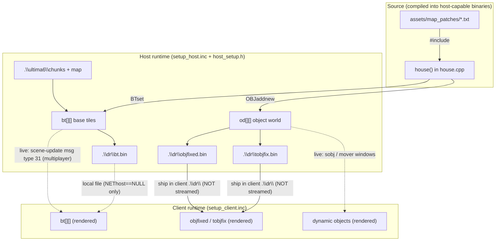
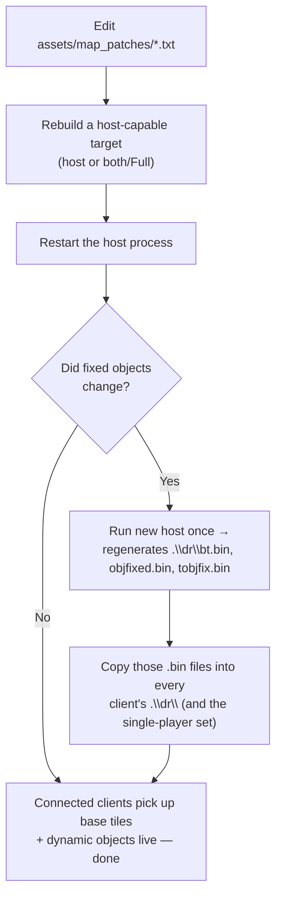

# Map Data: Host ↔ Client Sync

**Status:** Documented June 2026. **Updated 2026-06-17** — clients now download
the host's current fixed-object files at connect time (see
[§ Client map-data download](#client-map-data-download-mdd-since-u6o_version-14)),
which removes the manual `.bin` redistribution step described below.
**Applies to:** anyone editing `assets/map_patches/*.txt`, `house()` in
`src/common/house.cpp`, or the baked `.\dr\*.bin` map files.
**Origin:** a "`#include`d map patch was commented out, host rebuilt, but the
building still showed in game" investigation. See [§Worked example](#worked-example-i-commented-out-shoptxt-and-still-see-the-shop).

## TL;DR

- Map content lives in **source**: `assets/map_patches/*.txt` are
  `#include`d into `house()` and compiled into the binary.
  Editing a `.txt` does nothing until you recompile a **host-capable** binary.
- `house()` is compiled into `both`, `host`, and the Linux `host` targets
  only — **never the pure `client`** target.
  A stand-alone client has zero map-build code.
- At host startup the world is rebuilt from scratch every launch
  (`chunks` → `house()` patches → bake `.\dr\bt.bin`, `objfixed.bin`,
  `tobjfix.bin`).
  No world-save persists it.
- The client gets map data via **three different paths**. Historically one of
  them — **fixed objects** — did **not** stream over the wire, so a stale
  `objfixed.bin` / `tobjfix.bin` on a client was the most common "I changed
  the map but the client still shows the old geometry" cause. **Since
  `U6O_VERSION` 14 the client downloads the host's current fixed-object files
  at connect time** (see below), so this staleness no longer happens against
  an up-to-date host.
- Bump `U6O_VERSION` only when the **wire format** changes, never for ordinary
  content edits.

## Where map data lives (source of truth)

The authoritative map content is the set of patch files under
`assets/map_patches/`, which are `#include`d directly into the body of
`house()`:

```cpp
// src/common/house.cpp  (inside house())
#include "../../assets/map_patches/guardianguild.txt"
// ...
#include "../../assets/map_patches/shop.txt"   // line 116
```

Each patch is plain C executed inline, using two primitives:

- `BTset(x, y, tile)` — sets a **base tile** in the `bt[][]` array.
- `OBJaddnew(x, y, type, info, more2)` — creates a world **object** in the
  `od[y][x]` linked lists (walls-as-objects, furniture, doors, signs,
  ladders, …).

Because the patches are `#include`d, **a map change is a source change**.
It only takes effect after recompiling a binary that actually contains
`house()`.

`house()` is listed in `CMakeLists.txt` for exactly three targets:

| Target | EXE name | `CMakeLists.txt` | Compiles `house.cpp`? | Calls `house()`? |
| ------ | -------- | ---------------- | --------------------- | ---------------- |
| `both` (Full) | `Ultima VI Online Full.exe` | line 293 | ✅ | ✅ (defines `HOST`) |
| `host` | `Ultima VI Online Host.exe` | line 508 | ✅ | ✅ |
| Linux `host` | `u6o-host` | line 47 | ✅ | ✅ |
| `client` | `Ultima VI Online.exe` | — | ❌ | ❌ |

The pure `client` target does **not** compile `house.cpp` and never builds the
map.
It is a thin renderer that consumes whatever map data the host bakes or
streams.

## How the host bakes map data

The host rebuilds the entire world on every startup — there is no full-world
save to short-circuit it:

1. `src/server/setup_host.inc` loads raw base tiles from `.\ultima6\chunks`
   and `.\ultima6\map` into `bt[][]` (lines ~123–232).
2. `house()` runs (`setup_host.inc:251`) and applies every patch:
   `BTset` mutates `bt[][]`, `OBJaddnew` populates `od[][]`.
3. `src/server/host_setup.h` (included at `setup_host.inc:252`) walks the
   patched world and bakes three client-facing files into `.\dr\`:
   - `objfixed.bin` — fixed/static objects index + types (lines ~1067–1079).
   - `tobjfix.bin` — "top" / transparent fixed objects (lines ~1133–1144).
   - `bt.bin` — the patched base-tile array (lines ~1188–1199).

The only `.sav` files are **per-player** (`i.sav`), **house ownership**
(`house.sav`), and **guild shelf items** (`guardianobjs.sav`).
None of them store the static map, so the map is always regenerated from
source on launch.

## How the client receives map data (three paths)

The client loads map data in `src/client/setup_client.inc`:

```cpp
// objfixed.bin — ALWAYS loaded (line 919)
tfh=open(".\\dr\\objfixed.bin"); get(tfh,&objfixed_index,...); ...

if (NEThost==NULL){                 // line 922 — only when NOT connected to a host
  ZeroMemory(&bt,sizeof(bt));
  tfh=open2(".\\dr\\bt.bin",...);   // line 924 — base tiles from local file
  get(tfh,&bt,1024*2048*2);
}

// tobjfix.bin — ALWAYS loaded (line 930)
tfh=open(".\\dr\\tobjfix.bin"); get(tfh,&tobjfixed_index,...); ...
```

That yields three distinct delivery paths:

| Map data | Multiplayer (connected to a host) | Local / no host (`NEThost==NULL`) |
| -------- | --------------------------------- | --------------------------------- |
| **Base tiles** (`bt[][]`) | Streamed **live** in scene-update messages as the player moves (`loop_client.cpp`, message type `31`); `bt.bin` is **not** read. | Loaded from local `.\dr\bt.bin` (`setup_client.inc:924`). |
| **Dynamic objects** (NPCs, ground items, openable doors) | Streamed **live** via the `sobj` / `mover` transmit windows. | n/a (a host is required). |
| **Fixed objects** (`objfixed.bin` / `tobjfix.bin`) | **Loaded from the client's own local files** (`setup_client.inc:919, 930`) — **never streamed**. | Same local files. |

There is **no in-game transfer** of `bt.bin` / `objfixed.bin` / `tobjfix.bin`
from host to client.
They ship inside the client's `.\dr\` folder and are read at startup.

## Data-flow diagram



## The gotcha: fixed objects don't stream

Base tiles and dynamic objects reach a connected client automatically — base
tiles via scene-update messages, dynamic objects via the `sobj`/`mover`
windows.
**Fixed objects do not.**

`objfixed.bin` and `tobjfix.bin` are loaded from the client's local `.\dr\`
unconditionally, even in multiplayer.
So if a map edit adds, moves, or removes a *fixed* object (most static
furniture, decorative walls drawn as objects, etc.), a client running an old
`.\dr\` keeps drawing the old geometry no matter how current the host is.

**This is the staleness the connect-time download (below) fixes.** Against an
up-to-date host, a connecting client now pulls the host's current `objfixed.bin`
/ `tobjfix.bin` and renders them, so manual redistribution is no longer
required. The paragraph below describes the *legacy* manual workflow, retained
for older hosts/clients and for the single-player (`NEThost==NULL`) path.

When map data changes, the regenerated `bt.bin`, `objfixed.bin`, and
`tobjfix.bin` are picked up automatically by connected clients (download);
for the single-player set they still need to be copied into the local `.\dr\`.

## Client map-data download (MDD, since `U6O_VERSION` 14)

Plan: [`docs/plans/plan-clientMapDownload.md`](../../plans/plan-clientMapDownload.md).

To remove the fixed-object staleness trap, a connecting client now downloads
the host's **current** fixed-object files instead of trusting whatever shipped
in its `.\dr\`:

1. **Manifest.** Right after the host accepts the client's version, it sends
   `MSG_MAPMANIFEST` (type `60`): a `{length, FNV-1a/32 checksum}` pair for each
   of `bt.bin`, `objfixed.bin`, `tobjfix.bin`. The host computes this once at
   bake time in `src/server/host_setup.h`.
2. **Skip-if-current.** For each fixed-object file the client compares the
   manifest checksum against (a) its **live in-RAM** arrays and (b) any
   `.\dr\hostcache\` copy. A match ⇒ no transfer.
3. **Chunked pull.** Otherwise the client requests the file in 16 KB slices
   (`MSG_MAPCHUNK_REQ`, type `61`), one request in flight; the host serves each
   slice from disk (`MSG_MAPCHUNK_RESP`, type `62`). The client verifies the
   assembled file against the manifest checksum, caches it under
   `.\dr\hostcache\<name>` (+ a `.sum` commit-marker sidecar), and hot-swaps it
   into the live `objfixed_*` / `tobjfixed_*` arrays.

`bt.bin` is **not** downloaded — base tiles already stream live (message `31`)
in multiplayer. Every failure path (bad checksum, disconnect, OOM, version
mismatch) leaves the setup-loaded local `.\dr\` data untouched, so the feature
can only improve freshness, never break a client that already worked. Mixed
`U6O_VERSION` peers are refused at the version check (no misdecode).

Implementation: `MAP_checksum*` / `MAP_file_path` in `function_both.cpp`;
manifest globals in `globals.inc`; host send/serve in
`loop_host_part_b_dispatch.cpp`; client `MAPDL_*` driver in
`function_client.cpp`; client dispatch in `loop_client_part_net.cpp`.

## Workflow to keep host and client in sync



Checklist:

1. **Edit the patch, then recompile a host-capable binary** (`host` or
   `both`/Full).
   The plain `client` build has no `house()` and is unaffected by patch edits.
2. **Restart the host.**
   A still-running old host serves the old world; connecting to it shows the
   old map.
   After restart, connected clients pick up new **base tiles** and **dynamic
   objects** live, with no client rebuild.
3. **If fixed objects changed:** against an up-to-date host (≥ `U6O_VERSION`
   14) connected clients now **download** the regenerated `objfixed.bin` /
   `tobjfix.bin` automatically — no redistribution needed. *(Legacy path, for
   the single-player set or pre-14 builds: run the rebuilt host once so it
   rewrites `.\dr\bt.bin`, `objfixed.bin`, `tobjfix.bin`, then copy those into
   the single-player data set, which reads `bt.bin` locally.)*
4. **Keep host and client pointed at the same `.\dr\`** during local testing,
   or you will mix new host output with an old client `.\dr\`.
5. **Verify the new code actually ran:** after launching the host, confirm
   `.\dr\bt.bin`, `objfixed.bin`, `tobjfix.bin`, and `log.txt` show the current
   timestamp.

## Worked example: "I commented out shop.txt and still see the shop"

The symptom that produced this doc:
`#include ".../shop.txt"` was commented out in `house.cpp`, the `host` target
was rebuilt, yet the shop still appeared in game.

The map pipeline above proves the edit is correct and sufficient — *for the
binary that actually generates the world*.
File timestamps revealed why it was not taking effect:

- `bin\host\debug\Ultima VI Online Host.exe` had a fresh build time, but it sat
  **alone** in its output folder with no game data, so it must run with its
  working directory set to the host data folder.
- That host data folder's `dr\bt.bin` and `log.txt` were **two days old** — if
  the freshly built host had actually been launched from there, both would have
  been rewritten with a current timestamp.
  The new host had never been run.
- The `both`/Full EXE (`Ultima VI Online Full.exe`), built ~45 minutes
  *earlier*, is its own host+client with a separately compiled copy of
  `house()`/`shop.txt`.
  Testing with the Full build runs the old, shop-included map.

Root causes, in order of likelihood:

1. Running a different binary than the one rebuilt (`both`/Full vs `host`).
2. Connecting to an old, still-running host instead of restarting it.
3. A stale local `.\dr\bt.bin` (single-player path) plus stale
   `objfixed.bin` / `tobjfix.bin` (always local) still containing the shop.

Quick confirmation test: delete the host data folder's `dr\bt.bin`, launch the
freshly built host from that folder, and confirm a new `bt.bin` appears with a
current timestamp.
If the shop is gone, it was a stale-binary / stale-data problem.

## Wire-format changes vs content changes

Plain tile/object/patch edits flow through the existing protocol **unchanged**
— do **not** bump `U6O_VERSION` for content edits.

Only when you change the **wire layout itself** (buffer dimensions, bit widths,
offset multipliers — e.g. `MV_TX_*`, the `sobj_*` buffers) must you:

1. update the encoder **and** decoder in **both** client and host,
2. mirror the change into the `.inc` copy of any `.cpp` that has one
   (`loop_host.{cpp,inc}`, `loop_client.{cpp,inc}`), and
3. bump `U6O_VERSION` in `src/common/define_both.h` in the **same** commit.

Mixed-version binaries silently misdecode fields, which is worse than a refused
connection.

## File / line reference index

| Concern | Location |
| ------- | -------- |
| Map patches `#include`d | `src/common/house.cpp` (`house()`, e.g. `shop.txt` at line 116) |
| `house()` invoked | `src/server/setup_host.inc:251` |
| Base tiles loaded from chunks | `src/server/setup_host.inc:123`–`232` |
| Bake `objfixed.bin` | `src/server/host_setup.h:1067`–`1079` |
| Bake `tobjfix.bin` | `src/server/host_setup.h:1133`–`1144` |
| Bake `bt.bin` | `src/server/host_setup.h:1188`–`1199` |
| Client loads `objfixed.bin` (always) | `src/client/setup_client.inc:919` |
| Client loads `bt.bin` (no-host only) | `src/client/setup_client.inc:922`–`928` |
| Client loads `tobjfix.bin` (always) | `src/client/setup_client.inc:930` |
| Client base-tile scene update (live) | `src/client/loop/loop_client_part_net.cpp` message type `31` |
| `house.cpp` compiled (targets) | `CMakeLists.txt:47, 293, 508` (not the `client` target) |
| Wire-version constant | `src/common/define_both.h` (`U6O_VERSION`) |
| **MDD** wire constants / message IDs | `src/common/define_both.h` (MDD block: `MSG_MAPMANIFEST/REQ/RESP`, `MAP_*`) |
| **MDD** checksum + file paths | `src/common/function_both.cpp` (`MAP_checksum*`, `MAP_file_path`) |
| **MDD** host manifest build | `src/server/host_setup.h` (after the bt.bin bake) |
| **MDD** host manifest send + chunk serve | `src/server/loop/loop_host_part_b_dispatch.cpp` |
| **MDD** client download driver | `src/client/function_client.cpp` (`MAPDL_*`) |
| **MDD** client message dispatch (60/62) | `src/client/loop/loop_client_part_net.cpp` |
| **MDD** plan | `docs/plans/plan-clientMapDownload.md` |

